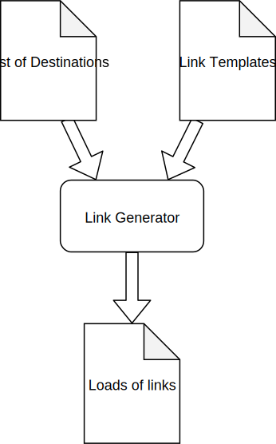

## An Introduction to Fastparse

Greg Dorrell  

FastParse is a Scala library for creating parsers
Note:
Recently I used it at work and found it really pleasant to use, so I thought I'd talk about it.

A parser takes text and turns it into structured data

Regex gets ugly quickly
Note:
- Regex is nice for validating strings, and manipulating them
- Not great for turning them into structured data
- Gets horrible to read quickly, especially if you're dealing with nested structures

Parser Generators  
<small>like LEX and YACC</small>
Note:
- AKA Compiler compilers - these do code generation
- Back at uni where I used lex and yacc to build a C-like language
- They were pretty awkward to use. 
- I had to learn a "metalanguage"/DSL for lexing and parsing
- I had to use C 🤞

FastParse
Note:
- It's a library written by Li Haoyi
- It allows us to create recursive descent parsers
- With recursive descent parsers we can define simple parsers and then compose them to form one big parser
- FastParse provides a nice DSL to defining and compose these parsers
- Let's dig into FastParse, its' syntax, and its' features a bit, using an example from my work:

### Motivation
Note:
- I work in the Growth Tech team at Vrbo (part of Expedia Group)
- I'm very much an application developer, not a programming language author, or even really a library author. 
- So why would I be creating a parser?
- It's not to implement some general purpose language, or parse existing languages like JSON/SQL
- Well, we ended up using it one of our systems to allow our users to create links
- We created a DSL for them.

### Domain Specific Languages
Note:
- For my team, a compelling usecase was creating a DSL for our users.
- So let's talk about DSLs a little 

There's two types of DSLs

Internal DSLs
Note:
As a Scala developer you already use lots of internal DSLs

Examples:
- ScalaTest
- SBT
- Akka Streams Graph DSL
- akka-http routing DSL.
- Free Monads/Tagless Final
Note:
- With ScalaTest you have a DSL for matchers, and different testing styles (e.g. WordSpec) which each have their own DSLs for defining and structuring tests
- With SBT; it's scala, but you have a DSL for creating projects and updating settings which doesn't look too much Scala code
- akka-http, and finch which we use at work, provide DSLs for creating HTTP services
- If you use techniques like Tagless Final or Free Monads, you're essentially allowing yourself to write programs in a really nice human-readable DSL and letting the interpreter worry about what needs to happen

External DSLs

Note:
You're also using lots of those.

Examples:

- regex
- SQL
- CSS

Internal vs External
Note:
- Internal DSLs are embedded in a language. 
- What's cool about that is you have access to the full power of the language… But, you run code written against an internal DSL, you need runtime for the underlying language. You're generally expected to know that underlying language.
- External DSLs are much more limited. They're often declaritive and simple to use, especially for non-technical users.

## Example DSL
Note:
- Were recently used FastParse to provide a DSL for our users.
- Let's take a look at what the problem was, and how we used FastParse to solve it.

| Destination ID |
|----------------|
| 1              |
| 2              |
| 3              |

Note:
Our users provide a table of destination IDs to generate links for

### Link Templates - Before

|Text|URL|
|----|---|
|Compare holiday rentals in {destination}|/d/{destination_id}|
|Pet friendly holiday rentals in {destination}|/search/keywords:{destination_keyword}?petIncluded=true|

Note:
- This is what we had before. Our users could specify "for each destination, generate a link with this text and this relative URL" by providing these two tables
- The Text has variables in it, and the "URL"s are a URL fragment which we can concate to form a URL

### Link Templates - After

|Text|URL|
|----|---|
|Compare holiday rentals in {destination}|LandingPage|
|Pet friendly holiday rentals in {destination}|SearchPage(petIncluded=true)|

Note:
- We introduced a DSL for specifying the URLs
- This DSL is more human readable than URL suffix's
- We can turn this into structured data that's nicer to work with than string concatination
- Only valid URLs can be specified and generated
- Hopefully easier to author for our users, or at least harder to make mistakes
- As we're generating structred data, we can do fancy stuff like "ensure we have some pet friendly vacation rentals in that destination" otherwise don't generate a link.

# Code

### Summary
Note:
- FastParse let's you create parsers.
- It's nice to use, the DSL is weird at first, but good!
- It's really fast. You can write a JSON parser that's as fast as hand written JSON parsers. (see http://www.lihaoyi.com/post/Fastparse2EvenFasterScalaParserCombinators.html#performance)
- You get nice error messages, basically for free
- And it can useful for application developers!
- If you find yourself doing horrible things with regex, or building systems for power users where a DSL might be useful, consider FastParse

# Questions?
Note:
- Thanks for listening!
- Slides and code are available at the link in the bottom left.

